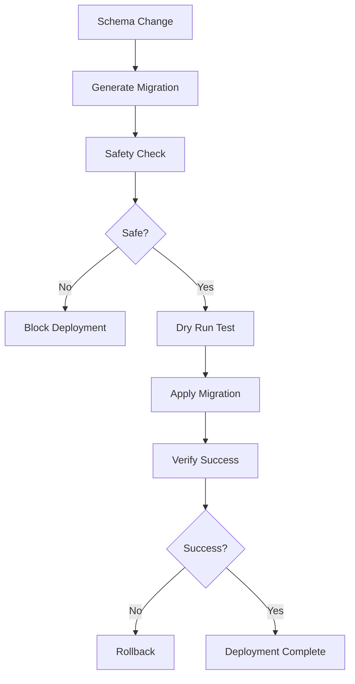

# Database Migration Strategy

## Overview

This document outlines our comprehensive database migration strategy that ensures data integrity and safe deployments in CI/CD environments.

## 🔒 Data Integrity Principles

### Never Lose Data

- **NO destructive operations** in automated migrations
- All migrations must be **reversible**
- **Backup before** every production migration
- **Test migrations** in staging environment first

### Safe Migration Practices

- ✅ **ADD columns** (always safe)
- ✅ **CREATE tables** (always safe)
- ✅ **CREATE indexes** (safe, may be slow)
- ⚠️ **ALTER columns** (requires careful planning)
- ❌ **DROP columns** (manual process only)
- ❌ **DROP tables** (manual process only)

## 📁 Migration File Structure

```
apps/server/
├── drizzle/                    # Generated migration files
│   ├── 0000_initial.sql       # Initial schema
│   ├── 0001_add_date_birth.sql # Add date_of_birth column
│   └── meta/                   # Migration metadata
├── src/migrate.ts              # Migration runner
└── drizzle.config.ts          # Drizzle configuration
```

## 🛠️ Development Workflow

### 1. Schema Changes

```bash
# 1. Modify schema in packages/database/src/schema.ts
# 2. Generate migration
cd apps/server
npm run db:generate

# 3. Review generated migration file
cat drizzle/[latest].sql

# 4. Test migration locally
npm run migrate:up
```

### 2. Safety Validation

```bash
# Check migration safety
npm run migrate:check

# Verify no destructive operations
grep -r "DROP\|ALTER.*DROP" drizzle/
```

### 3. Local Testing

```bash
# Test with real data
npm run db:seed              # Add test data
npm run migrate:up           # Apply migration
npm run test:integration     # Verify functionality
```

## 🔄 CI/CD Integration

### Automated Triggers

- **On schema changes**: `packages/database/src/schema.ts`
- **On migration files**: `apps/server/drizzle/**`
- **Manual trigger**: Workflow dispatch for specific environments

### Safety Checks

1. **Migration Detection**: Only run when schema changes detected
2. **Syntax Validation**: Verify SQL syntax correctness
3. **Safety Analysis**: Block destructive operations
4. **Dry Run**: Test migrations without applying changes
5. **Backup Creation**: Create database backup before migration
6. **Rollback Ready**: Automatic rollback on failure

### Workflow Stages



## 📝 Migration Scripts

### Available Commands

```bash
# Generate migration from schema changes
npm run db:generate

# Check migration safety
npm run migrate:check

# Apply migrations
npm run migrate:up

# Manual migration runner
node dist/migrate.js up
```

### Migration Runner Features

- ✅ **Connection validation** before migration
- ✅ **Detailed logging** of each step
- ✅ **Table verification** after migration
- ✅ **Column existence checks**
- ✅ **Automatic cleanup** of connections
- ✅ **Error handling** with rollback support

## 🚨 Emergency Procedures

### Manual Rollback

```bash
# For critical production issues only
# 1. Identify target migration
npm run migrate:check

# 2. Manual database restore
pg_restore -d production_db backup_file.sql

# 3. Update migration state
# Manual intervention required
```

### Production Migration Process

1. **Pre-deployment**:

   - Test in staging environment
   - Create database backup
   - Verify rollback procedure
   - Get team approval

2. **Deployment**:

   - Use workflow dispatch
   - Monitor logs in real-time
   - Verify application functionality
   - Check performance impact

3. **Post-deployment**:
   - Validate data integrity
   - Monitor error rates
   - Confirm user functionality
   - Document any issues

## 📊 Migration Examples

### Safe Column Addition (date_of_birth)

```sql
-- ✅ SAFE: Adding nullable column
ALTER TABLE "users" ADD COLUMN "date_of_birth" timestamp;

-- Features:
-- - Nullable (no data required)
-- - No default value needed
-- - Existing data unaffected
-- - Reversible operation
```

### Unsafe Operations (Manual Only)

```sql
-- ❌ DANGEROUS: Never in automated migrations
ALTER TABLE "users" DROP COLUMN "old_field";
DROP TABLE "deprecated_table";
ALTER TABLE "users" ALTER COLUMN "email" DROP NOT NULL;

-- These require:
-- - Manual execution
-- - Data migration plan
-- - Rollback strategy
-- - Team approval
```

## 🔍 Monitoring & Validation

### Automated Checks

- **Schema consistency**: Compare schema.ts with database
- **Migration completeness**: Verify all migrations applied
- **Data integrity**: Check constraints and relationships
- **Performance impact**: Monitor query performance

### Manual Verification

```sql
-- Check migration state
SELECT * FROM drizzle_migrations ORDER BY created_at;

-- Verify critical tables
SELECT table_name FROM information_schema.tables
WHERE table_schema = 'public';

-- Check specific column
SELECT column_name, data_type, is_nullable
FROM information_schema.columns
WHERE table_name = 'users' AND column_name = 'date_of_birth';
```

## 🎯 Best Practices

### Schema Design

- **Nullable columns**: Default for new fields
- **Default values**: Provide when appropriate
- **Indexes**: Add for performance, but carefully
- **Constraints**: Add gradually to avoid data issues

### Migration Strategy

- **Small changes**: One logical change per migration
- **Backward compatible**: Support old and new versions
- **Tested thoroughly**: Never migrate untested code
- **Documented well**: Explain complex migrations

### Environment Management

- **Development**: Fast iterations, db:push acceptable
- **Staging**: Exact production replica, full migration testing
- **Production**: Only vetted migrations, full backup, monitoring

## 🔐 Security Considerations

### Access Control

- Migration runner requires database admin privileges
- Production migrations require manual approval
- Backup access limited to authorized personnel
- Migration logs contain no sensitive data

### Data Protection

- No sensitive data in migration files
- Backup encryption for production data
- Secure connection strings in CI/CD
- Audit trail for all migration activities

## 📋 Checklist

### Before Migration

- [ ] Schema changes reviewed and approved
- [ ] Migration generated and tested locally
- [ ] Safety checks passed
- [ ] Staging environment tested
- [ ] Backup strategy confirmed
- [ ] Rollback plan documented

### During Migration

- [ ] Real-time monitoring active
- [ ] Team notification sent
- [ ] Migration logs reviewed
- [ ] Application health checked
- [ ] Performance monitoring active

### After Migration

- [ ] Data integrity verified
- [ ] Application functionality confirmed
- [ ] Performance impact assessed
- [ ] Documentation updated
- [ ] Team notified of completion

## 🚀 Future Enhancements

### Planned Improvements

- **Blue-green deployments**: Zero-downtime migrations
- **Migration testing**: Automated integration tests
- **Performance analysis**: Migration impact measurement
- **Advanced rollback**: Automated rollback triggers
- **Multi-environment**: Consistent migration across environments

This migration strategy ensures that database changes never compromise data integrity while enabling safe, automated deployments through CI/CD pipelines.
